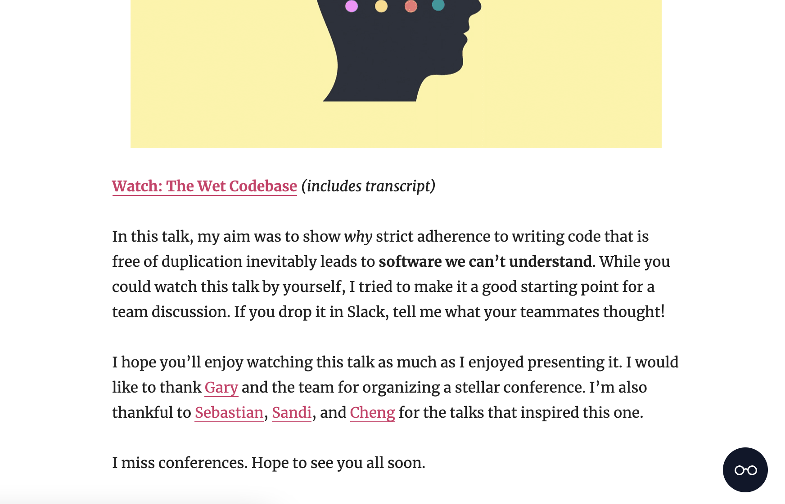

# eazy-reader

<div style="text-align: center">
  
</div>

A tiny little widget that improves your online reading experience.

<div style="text-align: center">
  
</div>

# Installation

```js
<script src="eazy-reader.js"></script>
<script>
  new EazyReader();
</script>
```

# Options

```js
new EazyReader({
  /*
    Controls the backdrop blur

    @type {Boolean}
    default: true
  */
  blur: true,

  /*
    Controls the intensity of backdrop blur
    
    @type {Number}
    default: 5
  */
  blurIntensity: 5,

  /*
    The height of the background filter

    @type {Number}
    default: 150
  */
  lensHeight: 150,

  /*
    The opacity of the background filter.

    @type {Number}
    default: 0.8
  */
  lensOpacity: 0.8,
});
```
